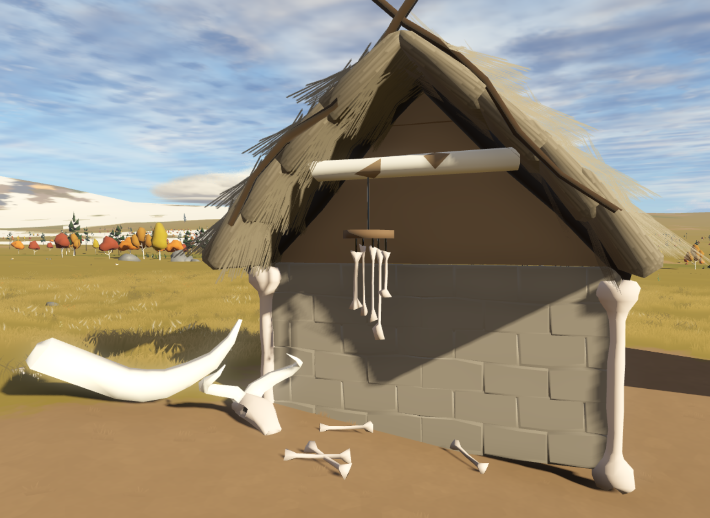

# Sapiens: Bone Crafting Mod

Bone Crafting is an 'Expansion Mod' for [Sapiens](https://www.playsapiens.com/), which introduces all kinds of bone-related items and recipes.

 - [STEAM LINK](https://steamcommunity.com/sharedfiles/filedetails/?id=2966239212)

## Using the Mod
 - The mod requires [Hammerstone](https://steamcommunity.com/sharedfiles/filedetails/?id=2840825226).
 - [Join the discord for Support.](https://discord.gg/WnN8hj2Fyg)

## Contents

### Decorations
 - Bone Mask
 - Tusk
 - Wind Chimes
 - Sheep Skull
 - Giant Bone Decoration

### Food
 - Bone Broth

### Tools
 - Bone Great Axe

### Buildables
 - Bone Chair